<p align="center">
  
</p>

<p align="center">
  <a href="https://github.com/ishandutta2007/Awesome-Awesome-Awesome"></a><a href="https://discord.gg/jc4xtF58Ve"></a> <a href="https://opensource.org/licenses/MIT"></a> <a href="http://makeapullrequest.com"></a> <a href="https://github.com/ishandutta2007/Awesome-Log-Management/stargazers"></a> <a href="https://github.com/ishandutta2007/Awesome-Log-Management/network/members"></a> <a href="https://github.com/ishandutta2007"></a>
</p>

---

# 📜 Awesome Log Management 🚀

> **A curated directory of SaaS platforms, open-source engines, log collectors, processors, and architectural best practices for enterprise centralized logging and observability.**

Log management platforms collect, parse, index, search, and analyze event logs from infrastructure, microservices, cloud resources, and security tools. Whether diagnosing production outages, satisfying SOC 2 / HIPAA compliance audits, or orchestrating real-time SIEM threat detection, picking the right log management stack is essential for modern DevOps, SRE, and SecOps engineering teams.

---

## 📑 Table of Contents

- [🌐 SaaS / Hosted Cloud Platforms](#-saashosted-cloud-platforms)
  - [Market Size & Industry Landscape](#-market-size--industry-landscape)
  - [SaaS Pricing & Limits Comparison](#-saas-pricing--limits-comparison)
- [💻 Open-Source GitHub Projects](#-open-source-github-projects)
  - [Ranked by GitHub Stars](#-ranked-by-github-stars)
- [🏗️ Architectural Blueprints & Stacks](#️-architectural-blueprints--stacks)
- [⚖️ SaaS vs. Self-Hosted Decision Guide](#️-saas-vs-self-hosted-decision-guide)
- [🛠️ How to Contribute](#️-how-to-contribute)
- [📈 Star History](#-star-history)
- [💖 Support & Sponsoring](#-support--sponsoring)
- [📄 Disclaimer](#-disclaimer)

---

## 🌐 SaaS / Hosted Cloud Platforms

### 📊 Market Size & Industry Landscape

> **Market Valuation & Growth**: The global log management and analytics sector is valued at **$3.3 billion – $4.5 billion in 2025/2026** and is projected to expand to **$10 billion – $13 billion by 2035** at a compound annual growth rate (CAGR) of **12% to 17%**.  
> **Market Structure**: The sector is **moderately-to-highly fragmented** across niche log shippers, open-source telemetry collectors, and independent vendors, but is experiencing rapid vendor consolidation driven by cybersecurity and enterprise observability conglomerates (such as Cisco's $28B acquisition of Splunk, CrowdStrike's acquisition of Humio/LogScale, and Datadog's expanding footprint).

### 🏷️ SaaS Pricing & Limits Comparison

Below is a detailed comparison of leading commercial SaaS log management platforms, **sorted in descending order by company size** (market capitalization, recent acquisition valuation, or private valuation).

| 🏢 Platform / Vendor | 📊 Company Size (Valuation / Revenue) | 💵 Starting Tier Pricing | 🎁 Free Tier / Free Trial Limits | ⚡ Key Capabilities & Focus |
| :--- | :--- | :--- | :--- | :--- |
| **[CrowdStrike Falcon LogScale](https://www.crowdstrike.com/products/next-gen-siem/falcon-logscale/)** *(formerly Humio)* | **~$92B Market Cap** *(NASDAQ: `CRWD`, ~$3.9B ARR)* | **$5.95 / GB** ingested *(AWS Marketplace PAYG rate)* or entry private commit packages from ~$180/mo | **15-day free trial** of Falcon platform; **10 GB/day free tier** for third-party ingest for qualified Falcon Insight XDR accounts | Index-free streaming engine engineered for terabyte-to-petabyte daily ingest, real-time live filtering, and next-gen SIEM correlation. |
| **[Datadog Log Management](https://www.datadoghq.com/product/log-management/)** | **~$42B Market Cap** *(NASDAQ: `DDOG`, ~$2.7B ARR)* | **$0.10 / GB** ingested + **$1.70 / million events** *(15-day retention)* or **$2.50 / million events** *(30-day retention)* | **14-day free trial** with full platform capabilities, up to 5 hosts, and unlimited log ingest during trial | End-to-end telemetry correlating logs with APM traces and infrastructure metrics; Logging without Limits™ enables ingestion filtering and cold storage archiving. |
| **[Splunk Cloud Platform](https://www.splunk.com/en_us/products/splunk-cloud-platform.html)** *(Cisco)* | **$28B Valuation** *(Acquired by Cisco, ~$3.65B ARR)* | Starting at **~$150 / GB / month** *(~$1,800/yr per GB/day)*; Splunk Observability Cloud starts at **$15 / host / month** | **14-day free trial** of Splunk Cloud (**5 GB/day data limit**, no credit card required); Splunk Free software provides **500 MB/day permanently** *(self-hosted, no alerts)* | De facto enterprise SIEM and logging standard; Search Processing Language (SPL), massive ecosystem of integrations, automated threat intelligence, and compliance analytics. |
| **[Elastic Cloud](https://www.elastic.co/cloud/)** | **~$10B Market Cap** *(NYSE: `ESTC`, ~$1.33B ARR)* | Standard Tier starts at **$99.00 / month** *(hosted cluster baseline)* or **$0.59 / hour** serverless compute | **14-day free trial** with full solution access (includes **8 GB RAM / 240 GB storage** cluster deployment, no credit card required) | Fully managed Elasticsearch and Kibana with AI Assistant, OpenTelemetry ingestion, Index Lifecycle Management (ILM), and cross-cluster search. |
| **[Grafana Cloud Loki](https://grafana.com/products/cloud/logs/)** | **$6.0B Valuation** *(Series D, ~$150M+ ARR)* | Pro Tier starts at **$0 / month base + $0.50 / GB** log ingest *(30-day retention)* | **Free forever plan**: **50 GB logs/month**, 14-day retention, 10,000 metrics series, 3 users, no credit card required | Label-based log indexing inspired by Prometheus; eliminates expensive full-text index overhead, natively integrates with Grafana dashboards and alerts. |
| **[SolarWinds Papertrail](https://www.papertrail.com/)** | **~$2.1B Market Cap** *(NYSE: `SWI`, ~$780M ARR)* | Starting tier starts at **$7.00 / month** *(includes 1 GB/month transfer, 2-week search, 1-year archive)* | **Free forever plan**: **50 MB/month**, 48-hour search retention, 7-day archive, unlimited systems and users | Frictionless cloud syslog aggregation featuring lightning-fast live tailing, regex search, and zero-configuration log stream tailing. |
| **[Sumo Logic](https://www.sumologic.com/)** | **$1.7B Valuation** *(Acquired by Francisco Partners, ~$300M ARR)* | Essentials plan starts at **$0.15 per credit** *(approx. $3.00/GB scanned/stored)* | **30-day free trial** (**1 GB/day ingest**, 30-day retention, 20 users); **Perpetual Free plan** with **20 credits/day** *(~500 MB/day, 7-day retention)* | Multi-tenant SaaS continuous intelligence platform with automated log pattern clustering (LogReduce), anomaly detection, and compliance reporting. |
| **[Coralogix](https://coralogix.com/)** | **~$1.0B Valuation** *(Series D Unicorn, $238M+ raised)* | In-stream compliance pipeline starts at **$0.16 / GB**; Monitoring pipeline at **$0.17 / GB**; Frequent search at **$0.34 / GB** | **30-day free trial** with full platform capabilities (**up to 10 GB/day evaluation allowance**) | Streambased architecture parsing and analyzing logs in flight before storage, enabling sub-second alerting and direct querying against S3 cold storage. |
| **[Mezmo](https://www.mezmo.com/)** *(formerly LogDNA)* | **~$350M Valuation** *($110M+ venture funding raised)* | Pay-as-you-go starts at **$0.80 / GB** *(3-day retention)* or **$1.50 / GB** *(7-day retention)* | **14-day free trial** with unlimited data ingest; **Perpetual Free plan** with live streaming log tail *(0-day retention, up to 5 users)* | Modern telemetry pipeline for routing, filtering, transforming, and masking logs at ingest, reducing downstream ingestion costs. |
| **[Better Stack](https://betterstack.com/logs)** | **~$300M Valuation** *($28.6M+ venture funding raised)* | Telemetry logs bundle starts at **$25.00 / month** *(includes 40 GB logs/traces/metrics; ~$0.10/GB overage)* | **Free forever plan**: **3 GB logs/month** *(3-day retention)*, 10 uptime monitors, 1 status page, Slack and email incident alerts | ClickHouse-backed logging engine with sub-second SQL search, interactive live log tail, anomaly detection, and built-in incident response management. |
| **[Logz.io](https://logz.io/)** | **~$250M Valuation** *($140M+ venture funding raised)* | Pay-as-you-go starts at **$0.92 per ingested GB / day** *(includes 7-day hot retention)* | **14-day free trial** with full platform features (**up to 10 GB/day limit**, no credit card required) | Managed enterprise OpenSearch and OpenTelemetry observability platform equipped with Cognitive Insights AI for automatic root-cause detection. |

---

## 💻 Open-Source GitHub Projects

Centralized logging has a robust open-source ecosystem, offering self-hosted freedom, data sovereignty, predictable infrastructure expenses, and compatibility with the OpenTelemetry (OTel) standard.

### 🌟 Ranked by GitHub Stars

The open-source projects below are **sorted in descending order by GitHub star count**. Each star badge links directly to the repository's stargazers page.

1. **[Elasticsearch](https://github.com/elastic/elasticsearch)** [](https://github.com/elastic/elasticsearch/stargazers)  
   Distributed, JSON-based RESTful search and analytics engine for centralized log indexing, aggregation, and full-text querying across massive distributed clusters.

2. **[SigNoz](https://github.com/SigNoz/signoz)** [](https://github.com/SigNoz/signoz/stargazers)  
   OpenTelemetry-native open-source observability platform integrating logs, metrics, and APM traces in a unified interface, powered by ClickHouse columnar storage for blazing query speeds.

3. **[Grafana Loki](https://github.com/grafana/loki)** [](https://github.com/grafana/loki/stargazers)  
   Horizontally scalable, multi-tenant log aggregation system inspired by Prometheus. Loki indexes metadata labels rather than full message text, drastically lowering storage footprint and CPU overhead.

4. **[Vector](https://github.com/vectordotdev/vector)** [](https://github.com/vectordotdev/vector/stargazers)  
   High-performance, memory-safe observability data pipeline written in Rust. Vector collects, enriches, transforms (via Vector Remap Language - VRL), and routes logs, metrics, and traces with ultra-low latency.

5. **[OpenObserve](https://github.com/openobserve/openobserve)** [](https://github.com/openobserve/openobserve/stargazers)  
   Cloud-native observability and log search engine built in Rust on Apache Arrow and DataFusion. Delivers up to 140x lower storage costs by storing parquet data directly in object storage with single-binary deployment.

6. **[ZincSearch](https://github.com/zincsearch/zincsearch)** [](https://github.com/zincsearch/zincsearch/stargazers)  
   Lightweight alternative to Elasticsearch written in Go for full-text log indexing and search, operating with low memory footprints and simple single-binary deployments.

7. **[Logstash](https://github.com/elastic/logstash)** [](https://github.com/elastic/logstash/stargazers)  
   Server-side data processing and ETL pipeline that ingests data from multiple sources simultaneously, transforms it using rich filter plugins (Grok, Mutate, GeoIP), and ships it to Elasticsearch, OpenSearch, and object storage.

8. **[OpenSearch](https://github.com/opensearch-project/OpenSearch)** [](https://github.com/opensearch-project/OpenSearch/stargazers)  
   Community-driven, Apache 2.0-licensed distributed search and analytics suite (forked from Elasticsearch 7.10) featuring OpenSearch Dashboards, alerting, anomaly detection, and vector search.

9. **[Fluentd](https://github.com/fluent/fluentd)** [](https://github.com/fluent/fluentd/stargazers)  
   CNCF-graduated unified logging layer and event collector with hundreds of community plugins for collecting, buffering, and routing log streams reliably across diverse enterprise backends.

10. **[Elastic Beats](https://github.com/elastic/beats)** [](https://github.com/elastic/beats/stargazers)  
    Family of lightweight, single-purpose data shippers (Filebeat, Metricbeat, Packetbeat, Heartbeat, Auditbeat) for forwarding log files and system metrics reliably to Logstash, Elasticsearch, or Kafka.

11. **[Quickwit](https://github.com/quickwit-oss/quickwit)** [](https://github.com/quickwit-oss/quickwit/stargazers)  
    Sub-second cloud-native search engine written in Rust designed to query petabytes of logs and traces directly on cloud object storage (Amazon S3, Azure Blob, Google Cloud Storage) with Elasticsearch API compatibility.

12. **[Graylog](https://github.com/Graylog2/graylog2-server)** [](https://github.com/Graylog2/graylog2-server/stargazers)  
    Centralized log management platform with a dedicated web UI, message parsing rules, stream pipelines, real-time alerting, and role-based access control (RBAC).

13. **[Fluent Bit](https://github.com/fluent/fluent-bit)** [](https://github.com/fluent/fluent-bit/stargazers)  
    Super fast, lightweight, and highly scalable log, metrics, and traces processor written in C; the default de facto logging agent across Kubernetes, container runtimes, and embedded edge devices.

14. **[OpenTelemetry Collector](https://github.com/open-telemetry/opentelemetry-collector)** [](https://github.com/open-telemetry/opentelemetry-collector/stargazers)  
    Vendor-agnostic telemetry proxy that receives, processes, batches, filters, and exports telemetry data (logs, metrics, traces) using the universal OpenTelemetry Protocol (OTLP).

15. **[Uptrace](https://github.com/uptrace/uptrace)** [](https://github.com/uptrace/uptrace/stargazers)  
    Open-source APM and observability platform leveraging OpenTelemetry and ClickHouse to parse, monitor, and query logs, metrics, and distributed traces in high-load microservices.

16. **[syslog-ng](https://github.com/syslog-ng/syslog-ng)** [](https://github.com/syslog-ng/syslog-ng/stargazers)  
    Enhanced, enterprise-grade system log daemon with rich content-based filtering, message parsing, pattern classification, secure transport, and direct routing to databases and search backends.

17. **[rsyslog](https://github.com/rsyslog/rsyslog)** [](https://github.com/rsyslog/rsyslog/stargazers)  
    Rocket-fast, high-performance syslog processing daemon offering multi-threading, dynamic rulesets, TLS encryption, and high-volume message queuing for traditional Linux server environments.

---

## 🏗️ Architectural Blueprints & Stacks

Centralized logging architectures generally adhere to a four-tier pipeline:

```
[ Application / OS / K8s Pods ]
              │
              ▼
[ 1. Edge Shippers & Agents ] (Fluent Bit, Vector, Beats, Promtail)
              │
              ▼
[ 2. Ingestion & Pre-Processing Queue ] (Kafka, Vector Aggregator, Logstash, OTel Collector)
              │
              ▼
[ 3. Indexing & Storage Engine ] (Loki, OpenSearch, Elasticsearch, ClickHouse, Quickwit)
              │
              ▼
[ 4. Visualization & Alerting ] (Grafana, OpenSearch Dashboards, Kibana, Graylog Web)
```

### Popular Production Blueprints

- **Cloud-Native Kubernetes Stack**:
  - `Fluent Bit` (DaemonSet) ➔ `Grafana Loki` (Microservices mode) ➔ Object Storage (`S3`/`GCS`) ➔ `Grafana` UI.
- **Full-Text Enterprise Analytics Stack**:
  - `Filebeat` / `Vector` ➔ `Apache Kafka` buffer ➔ `Logstash` / `OpenSearch Ingest Nodes` ➔ `OpenSearch` ➔ `OpenSearch Dashboards`.
- **Cost-Optimized High-Volume Telemetry Stack**:
  - `OpenTelemetry Collector` ➔ `Vector` (aggregation & masking) ➔ `Quickwit` / `ClickHouse` (direct object storage indexing) ➔ `Grafana`.

---

## ⚖️ SaaS vs. Self-Hosted Decision Guide

| 🔍 Evaluation Criteria | 🌐 Managed SaaS Platforms | 💻 Self-Hosted Open Source |
| :--- | :--- | :--- |
| **Operational Overhead** | Zero infrastructure maintenance; automated scaling, patching, and backups. | Requires dedicated platform/SRE engineering time to tune indices, disks, memory, and sharding. |
| **Cost Predictability** | Ingestion & query fees scale with data volume; can produce sudden budget spikes. | Hardware/cloud compute & storage costs only; fixed cost for storage disks/object storage. |
| **Data Sovereignty** | Logs leave your network perimeter (unless using private cloud or self-managed VPC options). | 100% internal control; strictly adheres to data residency, on-premises, and banking regulations. |
| **Out-of-the-Box Intelligence**| Pre-packaged AI anomaly detection, out-of-the-box SIEM compliance rules, and managed alerts. | Custom alert rules, dashboards, and retention policies must be built and maintained by your team. |

---

## 🛠️ How to Contribute

Contributions from the developer, DevOps, and SRE communities are warmly welcomed!

1. **Fork the repository** on GitHub.
2. **Create a branch** for your update: `git checkout -b add-logging-tool`.
3. **Follow the formatting conventions**:
   - For **SaaS platforms**: Add to the table with company size, verified starting tier pricing, and free tier/trial details.
   - For **Open-Source projects**: Add the project with its official GitHub link, description, and star badge (`[](https://github.com/{owner}/{repo}/stargazers)`). Keep entries sorted by star count.
4. **Submit a Pull Request** with a concise description of your changes.

Check out our sister curated repositories at [Awesome-Awesome-Awesome](https://github.com/ishandutta2007/Awesome-Awesome-Awesome)!

---

## 📈 Star History

[](https://star-history.dera.page/#ishandutta2007/Awesome-Log-Management&type=date&legend=top-left)

---

## 💖 Support & Sponsoring

A huge **thank you** 🙏 to everyone supporting this open-source curation! Maintaining accurate tracking information, up-to-date pricing models, and architectural blueprints requires ongoing research and dedication.

If you find this repository valuable:
- ⭐ **Star this repository** to help fellow engineers find it.
- 🍴 **Fork and contribute** your tools, fixes, and insights.
- 📢 **Share** with colleagues, DevOps communities, and SRE networks.
- ☕ **Support on GitHub Sponsors**: Help fuel further maintenance and open curation via the [GitHub Sponsor Dashboard](https://github.com/sponsors/ishandutta2007).

<p align="center">
  <a href="https://github.com/sponsors/ishandutta2007">
    
  </a>
</p>

---

## 📄 Disclaimer

- This is an independent, community-curated directory. Product names, logos, and brands are property of their respective owners.
- Log data often encapsulates sensitive PII, security event records, and regulated compliance data. Retention, encryption at rest/transit, and access control policies must adhere to organizational compliance requirements.

---

<p align="center">
  <b>Built for SREs, platform engineers, and security teams who need reliable, scalable log visibility.</b><br>
  <sub>Let's keep logs searchable, cost-efficient, and accessible.</sub>
</p>
